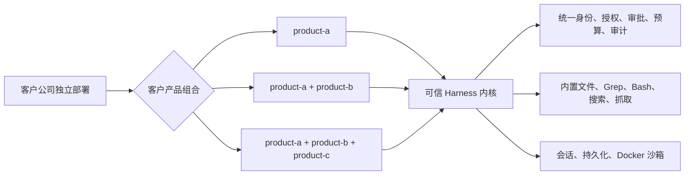

# SuiteHarness

面向公司服务器的多产品 AI Agent（人工智能智能体）Harness（驾驭与安全运行框架）。

SuiteHarness 解决的不是“再写一个聊天机器人”，而是把公司产品 A、AB 或 ABC 组合交付时反复出现的底座能力收敛为一套可审计的运行框架：每个产品可以选择自己的记忆、知识库、Agent 编排、提示词、反思策略、工具、MCP（Model Context Protocol，模型上下文协议）服务和模型路由，而身份、权限、审批、沙箱、会话与审计仍由公司服务器统一控制。

> 当前版本：`0.1.0` Alpha（早期验证版）。仓库已有可调用的公司 ASGI（异步服务器网关接口）应用、生命周期、健康门和 Uvicorn 便捷入口，但仍需部署项目注入真实产品、公司认证及外部服务适配器；它不是“拉取后一个命令即可上线”的完整产品。

## 交付形态

本项目只支持一种形态：**公司服务器部署 + 公司级 Web 前端和/或飞书入口**。

- 不支持、也不规划个人电脑常驻助手、个人账号代理或个人订阅凭据接入。
- 一个客户公司默认独立部署；代码仍保留 `tenant_id`（租户标识）以保证所有数据键、权限和审计记录有明确公司边界。
- 直接拉取源码开发和构建公司部署制品；当前不把 Python 包仓库安装作为交付方式。
- Windows 可用于源码开发；当前生产安全基线是 Linux 宿主上的 Docker 沙箱。生产启动还强制使用 Linux `dir_fd`（目录文件描述符）工作区后端，缺少该能力会失败关闭。

## A、AB、ABC 为什么能共用一套底座

`Customer Bundle`（客户产品组合）选择本次交付的产品，`Product`（产品）声明自己的可替换能力，`Harness Kernel`（可信运行内核）拥有不可替换的安全边界。



例如，`product-a` 可以使用长期画像 + ReAct 工作流，`product-b` 使用无长期记忆 + 自定义工作流，`product-c` 使用另一套知识库和反思策略。组合不会迫使三个产品共用实现，也不会让同一种实现自动共用数据。

用户画像默认按 `tenant_id + product_id` 隔离。AB 或 ABC 需要共享少量事实时，必须把组合配置切换为 `curated`（策展式共享）并声明精确的“生产产品 → 消费产品 → 字段”规则；数据还要经过实体映射、候选提交、人工或可信策略审核和来源记录，产品不能直接读取另一个产品的私有画像。共享文件区是另一项独立配置，同样默认关闭，并且要逐产品声明只读或读写。

持久对话历史默认进一步按用户隔离。`share_conversation_sessions=true` 可让同一公司渠道会话的成员共享历史，但 Web 必须接入可信成员 ACL（访问控制列表）逐消息授权；工具授权和审批仍绑定实际发起人。

产品入口也可注入 `ProductAccessAuthorizer`（产品访问授权器），按真实公司用户、角色、渠道和路由后的产品逐消息连接公司 IAM/ACL；拒绝、目录异常或超时时失败关闭。产品 ACL 与共享会话 ACL 共用 10 秒默认、60 秒硬上限。省略该接口的明确语义是“所有已认证公司用户都能访问本次已购组合内的全部产品”，有部门隔离要求时不能只靠前端隐藏菜单。

## 已实现的框架能力

| 领域 | 当前实现 |
| --- | --- |
| 产品组合 | 严格产品描述、A/AB/ABC 组合解析、版本/配置校验、产品内部能力包依赖与冲突检查、两阶段激活及失败回滚 |
| Agent | 默认 ReAct（Reason + Act，推理并行动）工作流、产品级工作流/提示词/反思替换点；工具只能形成调用意图，最终仍经过统一执行器 |
| 内置工具 | `fs.list/read/write/edit/glob/grep`、`Bash`、`web_search`、`web_fetch`；没有内置删除工具 |
| 工具安全 | 精确工具身份、JSON Schema（JSON 结构规则）参数校验、短时能力授权、读写效果检查、一次性审批、预算、取消和结构化审计 |
| 工作区与沙箱 | 按公司/产品划分目录，共享目录默认关闭；Docker 只读根、非特权用户、资源限制、默认断网，以及清理失败后的持久隔离与失败关闭 |
| 国内网络 | 百度千帆结构化搜索；微软 Foundry Bing 接口；抓取支持直连、公司代理和浏览器工作进程，带 SSRF（服务端请求伪造）防护及逐产品出口选择 |
| 模型 | 统一模型请求/响应及流式事件；OpenAI、Anthropic、Gemini、Bedrock、Vertex，以及 DeepSeek、通义千问、豆包、Kimi、MiniMax、智谱、百度等兼容端点适配器 |
| MCP | 对齐 `2025-11-25` 协议常量；工具、资源、提示词、补全、日志、任务、采样、引导交互、stdio、Streamable HTTP 与可选持久恢复；渠道权限默认全拒绝并按产品/服务/远端工具显式放行 |
| 插件 | 严格数据清单、摘要/签名验证接口、依赖图、权限上限、两阶段生命周期、原子发布、热替换与回滚 |
| 公司入口 | 公司 SSO（单点登录）凭据换短票、WebSocket 交互审批、飞书 Webhook/长连接、身份/ACL 调用硬超时，以及 `/health/live`、`/health/ready`、完整启动回滚和逆序关闭 |
| 状态 | SQLite 会话、原子运行 claim、硬容量、检查点、审计、产品状态、渠道去重、MCP 恢复游标和 Docker 清理隔离清单参考实现 |

“有适配器”不等于已经替每家模型厂商完成生产认证。不同模型、区域和接口版本仍需在部署前做契约测试。

## 两种渠道的权限差异

| 渠道 | 默认策略 | 写入 | 删除 |
| --- | --- | --- | --- |
| WebSocket | 由公司身份认证和产品工具模板授权 | 写工具仍需逐次交互审批 | 破坏性操作始终审批 |
| 飞书 | 全局只读 | 只可显式开放内置 `suiteharness.fs.write` / `suiteharness.fs.edit`，且只能写配置白名单目录 | 永不允许 |

飞书没有用户审批回路，因此不能获得 Bash、删除或默认视为写操作的 MCP 工具权限。仅在配置中填入可写目录还不够：服务器还必须为相同的 `(channel, product)` 配置精确工具授权模板，两层都通过才可写。

## 代码结构

```text
config/                    公司公开配置与密钥文件示例
deploy/sandbox/            Bash 沙箱参考镜像（不是完整服务镜像）
docs/                      架构、安全、产品开发、部署和中文模块指南
scripts/                   开源发行制品检查
src/suiteharness/
  runtime/                 作用域、产品描述、能力包、客户组合与生命周期
  agents/                  ReAct、提示词、反思和 Agent 事件契约
  execution/               统一工具执行、授权、审批、预算、取消与审计
  tools/ workspace/        内置工具及工作区路径策略
  sandbox/ web/            Docker/开发沙箱与国内搜索、受控抓取
  models/                  厂商无关模型层及各厂商适配器
  memory/                  产品私有画像、知识协议和策展式 Customer360
  mcp/ plugins/            MCP 协议栈与插件信任/生命周期
  sessions/ persistence/   会话、检查点、审计、恢复游标和沙箱隔离状态
  channels/ server/        WebSocket/飞书入口、会话主链与企业渠道组合器
tests/                     单元、契约、安全负向和组合测试
```

逐目录、逐模块的职责和例子见 [中文模块指南](docs/module-guide.zh-CN.md)。

## 从源码开始

需要 Python 3.11+。仓库不提供个人部署流程；公司需编写很小的组合模块，注入产品目录、激活器、授权模板和企业适配器后，使用内置 ASGI 应用运行。仓库没有预制全局 `app`、命令行启动器或完整服务镜像，因此也不声称“一键生产上线”。

```bash
git clone <your-fork-or-repository-url>
cd suiteharness
```

源码部署不等于无需安装依赖。请在公司的受控构建环境中，依据 [`pyproject.toml`](pyproject.toml) 安装并锁定核心依赖；使用 Bedrock/Vertex 时再加入 `aws`/`google` 可选依赖。然后运行：

```bash
python -m ruff check .
python -m pytest
python -m build
python scripts/check_distributions.py dist
```

生产配置从 [`config/suiteharness.example.yaml`](config/suiteharness.example.yaml) 和 [`config/suiteharness.secrets.example.yaml`](config/suiteharness.secrets.example.yaml) 开始。配置加载器只读取显式指定的 YAML 文件，不做环境变量插值；密钥文件不能提交版本库。

产品开发顺序：

1. 为 `product-a` 定义严格的 `ProductDescriptor`（产品描述）和产品配置模型；
2. 在可信宿主中实现 `ProductActivator`（产品激活器），绑定该产品的画像、工作流、提示词和反思策略；
3. 如有自定义工具、插件或 MCP 服务，分别声明能力上限与安全策略；
4. 将产品加入 `CustomerBundleManifest`；AB/ABC 只是增加选择项，不复制框架；
5. 用 `CompanyServerBootstrap`（公司服务器启动组合器）注入渠道认证、工具授权模板和产品实现，再创建内置 ASGI 应用对外提供 WebSocket/飞书。

详见 [产品开发指南](docs/product-authoring.md) 与 [公司部署指南](docs/deployment.zh-CN.md)。

## 生产边界

当前仓库提供的是可组合的框架和参考服务器主链，不是完整成品。上线前至少还需要由部署方提供或确认：

- 公司部署组合模块、反向代理、TLS、指标/告警、服务镜像和容器编排；框架已提供 Starlette ASGI 应用、健康/就绪路由、生命周期和 Uvicorn `run/serve` 入口；
- 企业 SSO 或 OIDC/JWT（两类身份令牌协议）认证器，以及飞书企业目录同步；框架只负责把已验证的公司登录态换成短时 WebSocket 票据；
- 产品目录、可信激活器、每个渠道/产品的工具授权模板；
- 基于参考 Dockerfile 构建、扫描并推送的沙箱镜像及真实摘要，受控出口网络、日志和监控；
- 插件签名验证器、隔离工作进程启动器，以及所选 MCP 传输适配器；
- Foundry 客户端、浏览器抓取工作进程、飞书官方 SDK 接线等外部依赖；
- 画像、知识和 Customer360 的生产存储；当前相应内置实现主要是进程内参考实现；
- 多实例所需的分布式授权、审批、限流、协调与高可用数据库。当前授权/审批/工具注册主要在进程内，SQLite 更适合单服务器参考部署；
- 数据保留、脱敏、备份、灾难恢复、合规审查和真实厂商模型契约测试。

可信进程内产品或插件与 Harness 共享 Python 进程权限；Docker 沙箱主要约束 Bash 和可接入的 stdio MCP，并不能自动隔离所有 Python 扩展代码。完整说明见 [安全模型](docs/security-model.md)。

## 文档

- [架构说明](docs/architecture.md)
- [中文模块指南](docs/module-guide.zh-CN.md)
- [产品开发指南](docs/product-authoring.md)
- [公司部署指南](docs/deployment.zh-CN.md)
- [安全模型](docs/security-model.md)
- [贡献指南](CONTRIBUTING.md)
- [安全漏洞报告](SECURITY.md)
- [变更记录](CHANGELOG.md)

## 设计来源

本项目参考了 deepseek-harness 的可插拔组合思想、OpenHarness 的通用运行底座分层，以及 OpenClaw 的记忆与溯源启发。SuiteHarness 采用自己的作用域、客户组合、策展式共享和执行安全模型，不声明与这些项目 API 兼容。

## License

[MIT](LICENSE)
