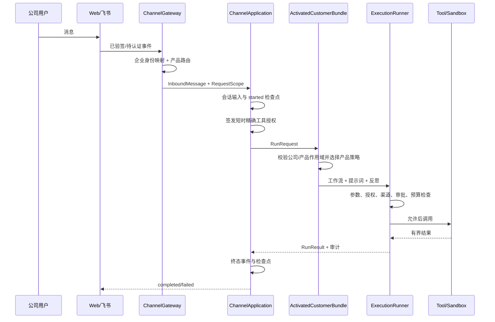

# SuiteHarness 架构

本文描述 `0.1.0` Alpha 的实际代码结构。SuiteHarness 是公司服务器中的 Agent（人工智能智能体）Harness（驾驭与安全运行框架），不是某个业务产品，也不是个人助手。

专业词第一次出现时采用“英文（中文解释）”形式。完整逐目录说明见 [中文模块指南](module-guide.zh-CN.md)。

## 1. 架构结论

框架把能力分成两类：

- **产品拥有的可替换能力**：用户画像、知识库、Agent 工作流、提示词、反思策略、产品工具、MCP 服务和模型路由。例如 `product-a` 和 `product-b` 可以使用完全不同的实现。
- **公司服务器拥有的固定边界**：认证后的作用域、工具注册表、短时授权、审批、预算、取消、审计、工作区、沙箱、渠道策略和生命周期。产品只能提交工具意图，不能直接替换统一执行器。

这一区分让 A、AB、ABC 三种交付都使用同一底座，同时避免某个产品凭自身配置扩大权限。

## 2. 部署与信任边界

唯一支持的部署拓扑是：

```text
公司 Web 前端 ── WebSocket ─┐
                            ├─ 公司服务器宿主 ─ SuiteHarness ─ 产品 A / B / C
飞书企业应用 ─ Webhook/长连接 ┘                    ├─ 模型厂商
                                                   ├─ MCP 服务
                                                   └─ Docker 沙箱
```

一个客户公司默认有一套独立服务和存储。虽然不是共享式 SaaS（软件即服务），代码仍让每个路径携带 `tenant_id`，以便身份、目录、授权、数据和审计始终绑定公司。框架永不支持个人部署、个人账号代理或个人订阅凭据。

信任分层如下：

1. **可信控制面**：公司认证、配置加载、`FoundationRuntime`、`HarnessKernel`、`ExecutionRunner` 和授权/审批机构。
2. **可信进程内扩展**：经制品校验并显式允许的产品激活器与 `trusted_in_process` 插件。它们共享 Python 进程权限，因此必须按服务器代码同等级审查。
3. **受限扩展**：Docker 中的 Bash、可注入的隔离插件工作进程、stdio MCP 和受策略约束的远程 MCP。
4. **不可信输入**：用户消息、模型输出、工具参数、渠道事件、网页内容、MCP 返回值和插件清单原始数据。

## 3. 两种“组合”不能混淆

### 3.1 Customer Bundle（客户产品组合）

`CustomerBundleManifest` 描述客户购买哪些产品及各自配置。例如：

- A：只选 `product-a`；
- AB：选择 `product-a`、`product-b`；
- ABC：再加入 `product-c`。

`ProductCatalog`（产品目录）只包含静态 `ProductDescriptor`（产品描述）。`resolve_customer_bundle()` 在执行产品代码前验证产品存在性、PEP 440（Python 版本约束规范）版本、Harness API 兼容性、严格产品配置和共享规则，得到不可直接授予权限的 `CustomerBundlePlan`（客户组合计划）。

计划不是许可证、签名锁文件或能力授权。宿主仍要把它和经验证的产品制品、激活器及公司授权策略组合。

### 3.2 Runtime Bundle（产品内部运行能力包）

`BundleManifest` 描述一个产品内部的组件依赖，例如 `product-a` 的 `knowledge-runtime` 依赖 `vector-client`。解析器检查：

- 版本和 Harness API 范围；
- 依赖闭包、缺失依赖和循环；
- 冲突关系；
- 重复的 `provides`（声明提供的服务）；
- 能力包需要的权限是否超出产品描述。

所有产品先完成 `prepare`（准备），内核再解析每个产品的完整依赖闭包。所有能力包都安装成功后，才执行任一产品的安装器；任何一步失败都按 LIFO（后进先出）顺序回滚。

因此，Customer Bundle 回答“客户买了哪些产品”，Runtime Bundle 回答“一个产品内部由哪些组件组成”。

## 4. 作用域、服务绑定与资源所有权

### 4.1 Scope（作用域）

实际层级是：

```text
RootContext
└── TenantScope(tenant_id)
    ├── ProductContext(product-a)
    │   └── AgentContext(agent_id, session_id)
    └── ProductContext(product-b)
        └── AgentContext(agent_id, session_id)
```

- `RootContext`：当前公司服务进程的基础设施；
- `TenantScope`：客户公司的逻辑边界；
- `ProductContext`：产品数据和可替换策略边界；
- `AgentContext`：一次 Agent/会话身份边界。

`RequestScope`（请求作用域）携带路径、`principal_id`（认证主体）、渠道、角色、用途、请求/关联标识，以及可选的可信持久会话所有者。它是经验证的不可变值对象，不是加密令牌；必须由可信渠道宿主根据认证结果创建，不能接受客户端自报。

### 4.2 Service Binding（服务绑定）

`ServiceKey` 是带类型和可覆盖层级的服务键，`ServiceBindings` 是不可变父子链。以 AB 为例：

- 默认 ReAct 可绑定在 Root，供 A、B 继承；
- A 可在 Product 层覆盖自己的工作流；
- 画像服务只能绑定到各自 Product，不能放到 Root/Tenant；
- Customer360 只能绑定到 Tenant，A 或 B 不能覆盖。

类可以复用，实例和数据命名空间不能因此共用。A、B 即便都采用同一个数据库适配器类，也必须分别构造实例并使用不同产品键。

### 4.3 Effect Scope（副作用作用域）

`EffectScope` 记录连接、进程、工具注册等需要释放的资源。子作用域先关闭，回调按 LIFO 执行；单个清理失败不会阻止其他清理，最终以聚合错误上报。激活关闭后拒绝新运行，并等待已接收运行排空。

## 5. 公司服务器装配

`SuiteHarnessConfigLoader` 从显式公开 YAML 和密钥 YAML 加载严格配置；未知字段、错误引用和不安全生产组合会失败。它不读取环境变量覆盖，也不做环境变量插值。顶层 `server` 配置统一声明公司 ASGI 的监听地址、连接上限、监听队列和启停超时；这些设置不再隶属于 Web 渠道，因此只启用飞书时仍能承载 Webhook 与健康路由。

`await FoundationRuntime.create(...)` 当前会以可回滚方式组装并启动：

- 公司工作区布局和 Web/飞书路径策略；
- Docker 生产沙箱或显式确认不安全的本地开发沙箱；
- 模型供应商注册表、路由和传输；
- 百度/Foundry 搜索与受控抓取服务；
- SQLite 会话、审计，以及共用运行数据库中的产品状态、MCP HTTP 恢复游标和 Docker 清理隔离清单；
- 进程内工具注册、能力授权和审批存储；
- Root 默认的产品路由 ReAct、提示词和无操作反思；
- `HarnessKernel`、渠道授权策略和九个受保护内置工具；
- 插件及 MCP 的服务器扩展宿主。

创建末尾会主动探测沙箱、运行数据库、会话和审计存储；`readiness()`（就绪状态）还覆盖插件、MCP、渠道、产品 activation（激活结果）和可选飞书长连接。部分构造、启动或后续装配失败时会按所有权反向回滚。直接构造 `FoundationRuntime(...)` 仍是低层接口，公司入口应使用异步工厂。

`CompanyServerBootstrap`（公司服务器启动组合器）在 Foundation 之上提供标准装配，`CompanyServerApplication` 提供 Starlette ASGI 应用、公司登录态换短票路由、WebSocket/飞书动态路由、健康门、lifespan（应用启停生命周期）和 Uvicorn `run/serve` 入口。它不会自动发现产品，也不会猜测公司的认证、授权或外部系统：部署项目仍须显式提供 `ProductCatalog`、与组合准确对应的 `ProductActivator`、每个启用渠道 × 产品的 `ToolAccessTemplate`、`CompanyHttpAuthenticator`，以及按配置所需的飞书、插件、MCP、Foundry 或浏览器适配器。详见 [部署指南](deployment.zh-CN.md)。

标准启动顺序由 `CompanyServerBootstrap.build()` 执行：

1. 加载和验证两份配置；
2. 用部署方提供的静态、已验证产品目录解析客户组合；
3. Web 开启时先创建唯一的 `WebApprovalRuntime`，把它的同一个 coordinator 传给 `FoundationRuntime.create()`；
4. 为每个产品准备工作区；
5. 选择可信产品激活器并调用 `HarnessKernel.activate_customer_bundle()`；
6. 启动插件并把产品级 MCP 连接附着到已激活产品；
7. 创建每个启用渠道 × 产品的精确内置/产品工具授权模板，并从配置读取默认拒绝的 MCP 服务/工具白名单；
8. 用 `CompanyChannelRuntime.create()` 连接 activation、会话、工具、授权、Web 审批、飞书适配器和 MCP 已发现工具清单，并把 `foundation.runtime_database` 作为同一个运行数据库传入；
9. 启动可选飞书长连接并聚合就绪状态；只有全真才让 ASGI 应用接收渠道流量；停机先关闭渠道，再取消长连接任务，最后关闭 Foundation。

ASGI 固定提供 `/health/live` 和 `/health/ready`。Web 开启时还提供配置的 `session_path`（默认 `/auth/session`）：浏览器把已有公司 Cookie 或 Bearer（持有者）凭据交给部署方认证器，认证成功后得到短时 HMAC（基于哈希的消息认证码）WebSocket 票据。它是 SSO 后的凭据交换，不是框架自行实现公司登录。

## 6. 一次消息如何运行



`ChannelApplication`（渠道应用服务）用 `tenant + product + agent + session + effective session owner` 构造会话身份。默认所有者是当前主体；显式共享会话时，服务器使用绑定公司、渠道、会话和产品的合成所有者。相同外部消息重投可重放已保存终态；若进程在“已开始但未确认结果”时崩溃，恢复会失败关闭并交给运维核对，避免再次执行不确定副作用。

每轮运行前，应用从持久转录重建有界 `ConversationContext`（对话上下文）：只保留成功配对的用户/助手轮次，排除附件、metadata（附加元数据）、失败/取消/未配对轮次，并同时限制扫描数、消息数和字节数。上下文由服务器重建，客户端不能上传一段历史冒充可信会话；共享会话在提示词窗口中用 `participant-1` 等临时别名表示其他成员，不把其真实 `principal_id` 发送给外部模型。

当前应用主链发出 `started/completed/failed`，没有把模型增量逐片转发到渠道；事件模型虽保留增量类型，完整实时输出仍需后续接线。

## 7. 固定执行器与产品策略

| 能力 | 所有者 | 是否可按产品替换 |
| --- | --- | --- |
| `ExecutionRunner`（统一执行器） | Root | 否 |
| `Workflow`（工作流） | Root 默认，Product 可覆盖 | 是 |
| `PromptStrategy`（提示词策略） | Root 默认，Product 可覆盖 | 是 |
| `ReflectionStrategy`（反思策略） | Root 默认，Product 可覆盖 | 是 |
| `ProfileProvider`（画像提供器） | Product | 是，且必选 |
| `EvidenceProvider`（原始证据提供器） | Product | 是，可选 |
| `KnowledgeProvider`（知识提供器） | Product | 是，可选 |
| `Customer360Provider`（策展共享提供器） | Tenant | 只由宿主创建 |

默认 `ReActWorkflow` 负责让模型在“回答”和“提出工具调用”之间迭代，但它拿不到工具处理器。每个 `ToolIntent`（工具调用意图）仍要穿过统一执行器的工具身份解析、JSON Schema 参数校验、授权、效果分类、渠道策略、审批、预算、取消和审计。

工具注册按 Product → Tenant → Root 查找。框架内置工具位于受保护的 `suiteharness` 命名空间，产品不能用同名别名覆盖。

## 8. 画像、知识与策展共享

默认画像逻辑键至少包含：

```text
tenant_id / product_id / local_subject_id
```

所以 AB 组合中的 A 与 B，即使处理同一个自然人，也先有两个互不可见的产品内主体。默认 `customer360.mode=isolated`。

只有显式 `curated` 模式才建立如下路径：

```text
A 私有事实
  → 经核验的实体别名
  → 待审核共享候选
  → 策展者接受/拒绝
  → 带来源链的共享事实
  → 仅规则指定的 B 可消费
```

规则必须精确到 `producer → consumer → predicate`。例如只允许 A 向 B 分享 `company.preference.language`，不意味着 B 可以读取 A 的全部画像，也不自动形成 B → A 的反向权限。

`KnowledgeProvider` 要求先做授权再召回排序，避免先从越权语料检索后再过滤。当前画像、Customer360 和词法知识实现是进程内参考实现；生产存储由产品或部署项目实现。

## 9. 内置工具、工作区和网络

内置别名共九个：

```text
suiteharness.fs.list   suiteharness.fs.read   suiteharness.fs.write   suiteharness.fs.edit
suiteharness.fs.glob   suiteharness.fs.grep   suiteharness.shell.bash
suiteharness.web.search              suiteharness.web.fetch
```

文件工具使用工作区绑定，按选定空间和规范化逻辑路径授权。Linux 生产后端以根目录 fd 为锚逐段 `O_NOFOLLOW` 打开，list/glob/grep 不遍历符号链接，写入/编辑在同一父目录 fd 中原子发布；并发替换目录或最终链接不能把实际 I/O 导向工作区外。没有文件删除工具。

工作区默认形状：

```text
{workspace_root}/tenants/{tenant_id}/shared/
{workspace_root}/tenants/{tenant_id}/products/{product_id}/
```

每个产品默认只能读写自己的产品目录。共享目录默认关闭；启用后还必须在 `workspace.shared_access_by_product` 为每个产品分别声明 `read_only`（只读）或 `read_write`（读写），未列出的产品看不到共享目录。Web/internal 服从这项产品级策略；飞书在此基础上仍保持全局只读，只能显式给 `write/edit` 配置白名单子目录，且 `allow_delete=false`。

Bash 通过 `bash -lc` 在 `SandboxBackend`（沙箱后端）中执行。生产只接受摘要固定的 Docker 镜像，容器使用只读根文件系统、非特权用户、移除 Linux capabilities（内核特权能力）、禁止提权、限制 CPU/内存/进程/临时盘/时间/输出，网络默认关闭。若需要访问外部服务，只能选择运维预建的出口网络。每次启动 Docker 前先持久化准确容器名的 active lease（活动租约）；租约写入失败则不启动容器，正常完成或确认删除后才清除。进程硬崩溃、超时、取消、Docker CLI 异常或清理不确定都会留下租约，使重启后的整个 Docker 后端失败关闭，直到管理员按准确名称核对、必要时强制删除、再次确认容器消失并成功清除记录。

`web_search` 使用结构化搜索接口：百度千帆已有具体实现，Foundry Bing 保留注入客户端的适配面。`web_fetch` 可直连、通过公司 HTTP CONNECT 代理或浏览器工作进程；它对每次跳转重新解析地址、阻止私网/回环/链路本地等目标并要求对端 IP 证明，限制跳转、压缩、解压和文本大小。

Root 内置工具虽然共用，模型可选择的出口参数仍按产品检查：Bash 网络必须通过 `sandbox.network.allowed_profiles_by_product` 精确放行；搜索/抓取未配置产品条目时只允许公司默认 provider/route，非默认出口必须逐产品声明，显式空列表可连默认出口也禁用。例如 AB 可只允许 A 选择 `china-web` 网络，而 B 始终 `network=none`。

## 10. 模型层

`ModelGateway`（模型网关）把产品路由映射到管理员声明的主模型配置和后备配置，统一消息、工具、内容块、流式事件和能力声明。流式响应一旦收到首个事件，不会切换供应商拼接另一段响应。

内置原生适配器覆盖 OpenAI Responses、Anthropic Messages、Google Gemini、AWS Bedrock Converse 和 Google Vertex Gemini；兼容端点覆盖 DeepSeek、通义千问、豆包、Kimi、MiniMax、智谱 GLM、百度 ERNIE、ModelScope、SiliconFlow、OpenRouter、AiHubMix、Groq、Mistral、StepFun、公司服务器中的 Ollama 与 vLLM。

模型凭据只从服务器密钥引用解析，不进入请求正文或会话记录。不同供应商对工具调用、流式、多模态和参数支持不同，部署方必须按所选模型做契约测试，不能仅凭适配器名称判断全部特性可用。

## 11. MCP 与插件

MCP（Model Context Protocol，模型上下文协议）按 `(tenant, product, server)` 管理连接，首选协议版本 `2025-11-25`。实现包含初始化/能力协商、工具、资源、提示词、补全、日志、任务、采样、引导交互、进度/取消，以及 stdio 和 Streamable HTTP（可恢复流式 HTTP）传输模型。任务和 URL 引导默认受功能开关控制。

MCP 工具被桥接到同一个 `ExecutionRunner`。远端注解只作提示，默认工具效果为“写 + 外部访问”；只有管理员带理由的配置可降为只读或标记破坏性。MCP 连接不会成为跨产品全局单例。

渠道 MCP 权限的唯一配置入口是 `mcp.channel_access.<web|feishu>.<product>`，默认空即全部拒绝。`allow_servers` 会选中某个服务器当前发现的全部工具，`allow_tools` 则按 `server_id → 远端原始工具名` 精确选择；同一服务器不能同时使用两种规则。渠道宿主在启动时确认精确工具规则确实被发现，签发每次运行的短时授权时再核对工具身份和能力没有漂移。飞书只能选择最终注册为只读的 MCP 工具；Web 选中的写入/破坏性 MCP 工具仍逐调用审批。

Streamable HTTP 可通过 `resume_sessions=true` 开启重启恢复。`FoundationRuntime` 把运行数据库中的 `SQLiteMcpHttpResumeStore` 注入 MCP 管理器；恢复键绑定公司、产品、服务器标识和已配置端点的 SHA-256 摘要，只持久化 `session_id` 与 `last_event_id`，不写令牌、认证头或端点 URL，出口策略也禁止把 URL 改写到另一服务。每次 request/notification（请求/通知）结束后，即使远端操作报错，也在进程内串行地用 CAS 保存新游标；加载或保存失败会禁用该连接，避免带不确定游标继续请求。开启恢复时停机只关闭本地传输、保留远端会话；未开启时正常关闭会向远端发送 `DELETE`。

Plugin（插件）是显式配置路径下的制品，不进行目录扫描。框架先把 `suiteharness-plugin.json` 当不可信数据解析，再验证文件数量/大小、确定性 SHA-256 摘要、可选签名、允许路径、权限上限和依赖图。信任模式有：

- `trusted_in_process`：可信进程内；
- `isolated_worker`：隔离工作进程；
- `mcp`：通过 MCP 边界。

插件使用两阶段准备/激活和原子贡献发布；失败或替换时按反向顺序关闭。框架定义了隔离启动器和签名验证接口，但部署方要提供真实实现。

## 12. 渠道、会话、审计与持久化

`ChannelGateway` 先认证再路由产品。多产品组合要求消息显式携带产品，或服务器为 `(channel, conversation)` 配置唯一产品；多产品飞书配置至少要有明确路由。可选 `ProductAccessAuthorizer` 在路由后、构造可信作用域前，按真实主体和产品逐消息执行公司 ACL；拒绝、异常、非严格 `True` 或超时均失败关闭。产品 ACL 与共享 Web 会话成员 ACL 共用 `channels.authorization_timeout_seconds`，默认 10 秒、最大 60 秒。未注入表示组合内产品对全部已认证公司用户开放。

WebSocket：

- 握手前认证；
- 精确 Origin（网页来源）白名单，不接受通配符；
- 可使用企业 SSO 后签发的短时 HMAC（消息认证码）会话票据，或注入 OIDC/JWT 认证器；
- 严格帧模型、大小/并发/数量限制；
- 审批只发给同公司同主体的连接，决定绑定具体调用且一次消费。

`WebApprovalRuntime` 必须先于 Foundation 创建；这样执行器发出的挑战与 WebSocket 收到决定时使用同一个 hub/coordinator（中心/协调器）。标准 ASGI 会话交换路由把部署方认证器确认的公司登录态换成短时票据，部署代码不应直接接受浏览器自报身份后调用底层编解码器。

默认 `share_conversation_sessions=false`，Web/飞书同一 conversation 中不同用户各有持久历史。设为 `true` 后，同一公司、渠道、conversation、产品使用 synthetic session owner（合成会话所有者）并真正共享历史。Web 必须注入可信 `ConversationAuthorizer`（会话成员授权器）并逐消息核对成员 ACL；飞书 chat 标识来自已验签事件。工具 grant 与审批始终继续绑定发起消息的真实主体。

飞书：

- Webhook 先验证原始请求签名，再解密和解析；
- Webhook 在读取前核对唯一、合法的 `Content-Length`，并在流式接收时再次执行正文硬上限；
- 长连接通过官方 SDK 适配接口接线；
- 外部用户标识必须经公司目录映射为内部主体；
- 公司目录解析受 `channels.feishu.authentication_timeout_seconds` 限制，异常或超时失败关闭；
- 过滤机器人消息，群聊要求提及机器人；
- 默认只读，只有白名单目录下的内置写入/编辑可以开启，永不删除。

`CompanyChannelRuntime` 使用传入的 `foundation.runtime_database` 创建持久飞书事件去重，并要求部署方提供企业目录、出站发送器，以及 Webhook 解密器或长连接官方 SDK 适配器。若部署方不传数据库，组合器虽可自行打开相同配置路径，但会形成第二个连接和不同所有权；标准装配应复用 Foundation 已拥有的连接。

`SessionIdentity` 精确包含公司、产品、Agent、会话和主体。SQLite 会话存储支持事务、CAS（比较并交换）修订号、幂等事件、原子运行 claim（执行所有权声明）和检查点恢复。转录与运行 claim 是防止旧消息重新执行的证据，达到 `storage.session_limits` 时失败关闭而不静默裁剪；可替换的检查点按条数与累计字节只保留最新窗口。SQLite 审计日志公共接口只有追加，没有修改/删除。

`persistence` 还提供通用产品状态、渠道去重、MCP HTTP 恢复游标和 Docker 清理隔离清单。`FoundationRuntime` 自动连接会话、审计，并以唯一运行数据库连接创建产品状态、MCP 恢复和沙箱隔离存储；`CompanyChannelRuntime` 复用该连接创建飞书事件去重。关闭时渠道组合器不关闭外部注入连接，最终由 Foundation 统一关闭。

## 13. 生命周期与并发保证

- 每家公司同一时刻只允许一个客户组合处于激活或运行状态；
- 所有产品完成准备和整体校验后才安装；
- 所有产品内部能力包安装成功后才安装任一产品；
- 产品安装失败触发整个公司组合回滚；
- 工具注册、MCP 连接和资源由准确作用域拥有；
- 关闭先拒绝新运行，再等待已接收运行排空；
- 会话用进程内会话锁保证本进程顺序，并用 SQLite 修订号和持久运行 claim 在多进程竞争时失败关闭；claim 过期表示结果不确定，不能换新所有者再次执行。

内核没有为产品/插件生命周期回调内置强制超时，也不能中止不合作的同进程 Python 代码。生产宿主必须施加外部超时，并把不完全可信代码放进可终止进程或容器。

## 14. 当前生产缺口

`0.1.0` 已有较完整的协议与参考主链，但仍有这些边界：

- 已有公司 ASGI 应用工厂与 Uvicorn 便捷入口，但没有预配置的全局 `app`、命令行脚本、公司服务容器镜像、编排模板或一键上线流程；仓库已有 Bash 沙箱参考镜像；
- 企业 SSO 的真实校验、飞书目录、Foundry、浏览器工作进程、飞书 SDK、MCP 网络交换等仍是部署方注入接口；
- 插件签名验证器和通用隔离工作进程启动器未内置；
- 画像、Customer360、知识、能力授权、审批和工具注册主要是进程内参考实现；
- 原始证据只有协议，没有通用生产实现；
- SQLite 适合单公司单服务器参考部署，不是高可用分布式数据库；
- 没有分布式限流/配额、审批协调、集群租约或完整数据保留合规方案；
- Docker 沙箱不隔离可信进程内产品、插件和模型适配器；
- 当前渠道应用主链不转发模型增量事件。

这些是上线前必须由公司部署项目补齐的事项，不应在产品宣传中视为已完成能力。
